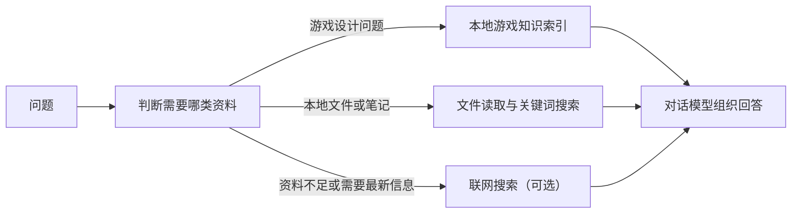

# Game Knowledge Agent

做游戏设计时，机制拆解、数值公式、外包规范和制作经验常散在不同资料里；需要核对一个判断时，往往得翻很久。这是一个把这些资料放进本地检索库、再用对话方式取用的项目。

当前随项目提供 **6,515 个游戏设计知识块**。它适合拿来讨论设计方案、找回已有做法，或在长对话里继续推演同一件事。

可以直接这样问：

> “后期金币溢出，但砍掉落又会让前中期太苦，应该从哪里调？”

> “角色技能的伤害和冷却怎么配，才不容易出现唯一解？”

> “美术外包的交付物反复返工，验收标准应该先定哪些？”

它给的是可供继续讨论的设计依据，不替项目做最终决策。库里没有的内容，或需要最新公开资料时，才会考虑联网搜索。

## 工作方式



默认检索会用本地 BGE 模型把问题和知识块编码后，取语义最接近的片段作为回答依据。相似度不足时不会把不相关的游戏资料硬套到问题上；处在边界的结果会结合问题的游戏语境再判断。

对话会保存在本机，也可以在界面中切换旧会话。会话过长时，早期内容会压缩成摘要供模型继续理解上下文，原始记录仍保留在本地。

## 跑起来

环境要求：Windows、Python 3.10，以及一个 OpenAI-compatible 聊天模型 API。

```powershell
.\scripts\setup.ps1
```

首次安装后，打开根目录的 `.env`，填入聊天模型配置：

```dotenv
LLM_API_KEY=your_api_key
LLM_BASE_URL=https://your-openai-compatible-endpoint/v1
LLM_MODEL=your_chat_model
```

然后构建一次本地索引并启动：

```powershell
.\.venv\Scripts\python.exe build_bge_combined_index.py
.\scripts\run.ps1
```

启动成功后，在浏览器打开 `http://localhost:8501`。之后通常只需要执行第二条命令。

首次构建会下载 BGE 模型并生成 SQLite 索引，耗时取决于网络和机器性能。索引不随 Git 提交；修改语料后可重建：

```powershell
.\.venv\Scripts\python.exe build_bge_combined_index.py --overwrite
```

## 配置

| 配置 | 是否需要 | 用途 |
| --- | --- | --- |
| `LLM_API_KEY` | 是 | 聊天模型的 API Key |
| `LLM_BASE_URL` | 是 | OpenAI-compatible 接口地址 |
| `LLM_MODEL` | 是 | 聊天模型名称 |
| `RAG_BACKEND=bge` | 否 | 默认值。本地 BGE 检索，不需要 embedding API |
| `METASO_API_KEY` | 否 | 当前内置联网搜索适配器的凭据 |
| `VISION_*` | 否 | 为图片文字识别指定单独的视觉模型 |

聊天模型通过 `LLM_*` 配置，接口需兼容 OpenAI Chat Completions。若 OCR 使用单独的视觉模型，可配置 `VISION_*`。

## 知识库

知识库来自公开资料。下面的数字是实际进入索引的知识块数量，不是仓库文件数量：

| 来源 | 侧重点 | 知识块 |
| --- | --- | ---: |
| [Being09/game-design-wiki](https://github.com/Being09/game-design-wiki) | 游戏设计方法与机制资料 | 712 |
| [diedie23/Game-Knowledge-Base](https://diedie23.github.io/Game-Knowledge-Base/) | 制作流程、美术管线、外包、排期与验收 | 621 |
| [Thaelith/open-game-mechanics-dataset](https://github.com/Thaelith/open-game-mechanics-dataset) | 结构化游戏机制与参数 | 2,676 |
| [lsc1414/Game_Num_Basics_And_Calc](https://github.com/lsc1414/Game_Num_Basics_And_Calc) | 中文数值设计与计算 | 1,809 |
| [zsc/gamedev_at_home](https://github.com/zsc/gamedev_at_home) | HTML5 游戏开发教程 | 609 |
| [tigermkiiiddd/senior-game-designer](https://github.com/tigermkiiiddd/senior-game-designer) | 策划思维与工作方法 | 88 |

已切分的语料保存在两个文件中：

- `data/game_knowledge_chunks.jsonl`：前两个来源，共 1,333 个知识块。
- `data/new_knowledge_chunks.jsonl`：后四个来源，共 5,182 个知识块。

`build_bge_combined_index.py` 会合并它们，得到 6,515 个向量并写入本地 SQLite 索引。查询时也必须使用同一个 BGE 编码器。

不要混用不同 embedding 模型生成的索引和查询编码器。索引必须由当前查询使用的同一模型生成；模型不同，向量空间不同，混用不会得到可靠结果。

当前查询是进程内全量余弦扫描：首次加载时把全部向量读入内存并缓存，之后每次查询对全量向量做一次矩阵相似度计算。6,515 块规模下没有问题；若语料预计超过约 10 万知识块（或单次检索延迟不再可接受），再改用 ANN 索引（如 FAISS / HNSW），在此之前不需要引入额外依赖。

## 本地与联网

知识块、BGE 模型、向量索引和会话记录都保留在本机。聊天回答仍会调用你在 `.env` 中配置的模型 API，因此发送给模型的是当前问题及必要的上下文。

联网搜索默认关闭。当前内置适配器使用 Metaso，这是作者使用的搜索服务；配置 `METASO_API_KEY` 后，Agent 才能在本地资料不足或问题需要最新公开信息时联网搜索，联网回答会明确说明这一点。

Ark 和 Metaso 都不是项目的必要依赖。Ark 只是保留的个人检索配置示例；默认的 BGE 检索不依赖它。若团队已有其他 embedding 服务，可以接入该服务并重建与之匹配的索引。

同样，Metaso 可以替换为 Tavily、SerpAPI 或团队已有的搜索服务。当前代码只内置了 Metaso 适配器，因此替换搜索服务需要实现或改写联网搜索工具，而不只是把 `TAVILY_API_KEY` 写入 `.env`。这不会影响本地知识库检索。

## 项目结构

```text
Agent.py                       Agent 与工具路由
UI.py                          Streamlit 对话界面
build_bge_combined_index.py    BGE 索引构建脚本
conversation_*.py              会话保存与上下文压缩
data/                          已切分的游戏知识语料
wiki_corpus/                   检索、向量索引和领域判断
scripts/setup.ps1              安装环境
scripts/run.ps1                启动界面
```

## 常见情况

**启动时提示找不到 BGE 索引**

先运行 `build_bge_combined_index.py`。新克隆的项目不包含生成好的 SQLite 索引。

**不配置作者使用的 Ark 或 Metaso 可以运行吗？**

可以。默认的 BGE 检索在本地运行；Ark 是可选检索配置，Metaso 是可替换的联网搜索适配器。聊天模型仍需要你自己的 OpenAI-compatible API。

**这是不是一个完全离线的应用？**

不是。检索可以完全本地运行，但对话回答使用你配置的聊天模型 API。若不配置搜索适配器的凭据，就不会使用联网搜索。
