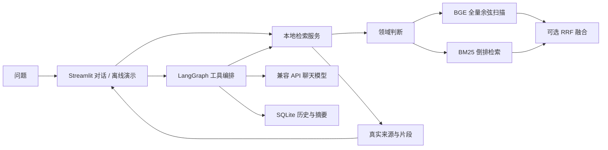

# 游戏知识助手

一个面向游戏设计资料的本地知识助手，用于查找机制、数值、经济系统与制作流程的依据，并延续同一个设计问题的讨论。

已有知识库包含 **6 个公开来源、6,515 个知识块**。支持 BGE 语义检索、BM25 关键词检索、RRF 混合检索，以及带原始来源的聊天历史。系统提供参考资料和设计建议，回答仍需结合具体项目判断。

## 可以怎样使用

- “玩家后期金币越来越多，经济系统如何设计回收机制？”
- “技能伤害和冷却怎样配合，才不容易出现唯一解？”
- “游戏美术外包交付时，怎样减少资产导入后的返工？”

启动后默认进入**离线检索演示**：只展示本地命中的资料片段，不调用聊天 API，也不生成结论。切换到“对话助手”后，才使用配置的聊天模型。回答依据可以展开查看，完整对话与来源可以导出为 Markdown。

## 快速运行

需要 Python 3.10。Windows PowerShell：

```powershell
.\scripts\setup.ps1
.\scripts\run.ps1
```

在浏览器打开 `http://127.0.0.1:8501`。没有模型凭据或 BGE 索引时，可选择 BM25 检索；语义路径资源不可用时会明确标注为关键词降级。

要使用 BGE，首次构建索引：

```powershell
.\.venv\Scripts\python.exe -X utf8 build_bge_combined_index.py
```

构建时会下载 `BAAI/bge-small-zh-v1.5`。运行和评估时仅加载本地缓存；修改语料后用 `--overwrite` 重建。生成的索引与模型权重不随 Git 提交。

要使用聊天，在 `.env` 中配置：

```dotenv
LLM_API_KEY=your_api_key
LLM_BASE_URL=https://your-openai-compatible-endpoint/v1
LLM_MODEL=your_chat_model
RETRIEVAL_MODE=bge
```

已有 DeepSeek、Ark 等兼容接口可沿用；不要求 OpenAI 账号。`RETRIEVAL_MODE` 可选 `bge`、`keyword`、`hybrid`，保留 BGE 为默认基线。可选的 `METASO_API_KEY` 启用内置联网搜索；`VISION_*` 为 OCR 指定独立模型。它们均不是本地检索的必要条件。

Linux/macOS 可创建 `.venv`，安装 `requirements.txt`，再运行 `python -m streamlit run UI.py --server.address 127.0.0.1`。本地检索与浏览器验证在 Windows 完成，Linux 离线测试由 GitHub Actions 执行；macOS 尚未验证。

## 架构与取舍


```mermaid
flowchart LR
    U[问题] --> UI[Streamlit 对话 / 离线演示]
    UI --> G[LangGraph 工具编排]
    UI --> R[本地检索服务]
    G --> R
    R --> D[领域判断]
    D --> B[BGE 全量余弦扫描]
    D --> K[BM25 倒排检索]
    B --> F[可选 RRF 融合]
    K --> F
    G --> L[兼容 API 聊天模型]
    G --> S[SQLite 历史与摘要]
    R --> E[真实来源与片段]
    E --> UI
```

| 位置 | 职责 |
| --- | --- |
| `Agent.py` | 兼容入口、工具注册、LangGraph 状态与上下文管理 |
| `game_agent/` | 配置、提示词、本地文件访问、来源核验及展示 |
| `wiki_corpus/retrieval.py` | 独立检索服务、阈值与显式降级 |
| `wiki_corpus/hybrid_search.py` | 中英文词项 BM25、RRF 排名融合 |
| `conversation_*.py` | 本地会话目录、摘要及完整轮次的输入预算 |
| `scripts/doctor.py` | 只读环境诊断，凭据仅报告存在状态 |
| `scripts/evaluate_retrieval.py` | 离线检索评估与 JSON/Markdown 报告 |
| `tests/` | 离线功能回归、图恢复、评估和界面交互 |

当前数据规模下使用内存矩阵扫描，便于复现和检查排序。向量在进程中缓存并预先归一化；BM25 的倒排索引按需构建。融合分数、词项分数和余弦相似度分别保存，不能把它们混作正确率。架构细节见 [说明](docs/architecture.md)。

## 验证与实验

```powershell
.\.venv\Scripts\python.exe -m pip install -r requirements-dev.txt
.\scripts\verify.ps1
.\.venv\Scripts\python.exe -X utf8 scripts/evaluate_retrieval.py --backend all --top-k 5 --output .runtime/retrieval_evaluation.json
```

单元测试使用临时数据库、占位凭据并阻止网络连接，不写入个人会话。本轮本地及无私有配置／索引的干净副本均通过 98 项测试。CI 安装最小测试依赖，不下载 BGE 权重；远程运行结果见 [GitHub Actions](https://github.com/Ryuuson/Game-knowledge-agent/actions)。评估与生成回答分开进行，评估不需要任何 API Key；BGE/混合路径如果发生降级，整组评估判失败并隐藏均值。

本轮评估共 **40 条 AI 辅助构造回归案例**：30 条正例覆盖六个来源，10 条非游戏边界问题。案例和证据经过程序核对，但**未经独立人工相关性审核，也不是盲测**。标签只列出选定的支持块，未穷举所有等价证据。以下数字是该回归集上的标注块召回，不能解释为回答准确率。

| 策略 | 排名 Recall@5 | 阈值后 Recall@5 | 阈值后非游戏拒答 | 游戏问题误拒 |
| --- | ---: | ---: | ---: | ---: |
| BGE | 46.7% | 40.0% | 10/10 | 4/30 |
| BM25 | 70.0% | 70.0%（没有语义阈值） | 8/10 | 0/30 |
| BGE + BM25 / RRF | 63.3% | 48.3% | 10/10 | 4/30 |

关键词在这组案例中召回更多标注块，但会给两个非游戏问题返回资料；混合策略改善部分召回，同时增加延迟与索引内存。保留三种路径供比较，不据小样本结果宣称普遍优于其他系统。结果、失败案例及测量口径见 [实验报告](docs/experiments.md)，评估集定义见 [evals](evals/README.md)。

真实聊天与检索排名需要分别验收。以下命令会向已配置的聊天服务发送两个固定问题，只允许本地检索工具，使用独立临时历史；报告写入本机：

```powershell
.\.venv\Scripts\python.exe -X utf8 scripts/smoke_chat.py --live
```

它只验证短对话链路，不代替人工核对回答的事实支持程度。

## 资料、隐私与边界

知识块、向量和会话保存在本机；聊天会将问题、必要上下文和检索片段发送给已配置的服务。联网搜索与 OCR 使用各自接口。程序面向本地单用户，启动脚本只监听 `127.0.0.1`。

来源编号由实际检索结果保存，未知编号会被标记。编号对应正确不代表结论必然被原文支持；资料本身也可能有时效或质量问题。BGE 的 0.62/0.67 阈值沿用既有设置，本轮没有用回归集重新调参。摘要失败时仍限制模型输入，完整历史保留。

原始 JSONL 中部分来源的许可证字段为 `TBD` 或 `Not specified by source`，部分没有有效行号或上游版本。实际统计及来源声明见 [语料核对](docs/corpus-provenance.md)。对外展示可优先提供程序、评估和必要片段；语料再分发需要进一步核对各来源授权。

本地私有资料、凭据、笔记、模型缓存与运行日志均不应提交；`.gitignore` 保留这些边界，新增测试与公开文档可以正常纳入版本管理。

## 文档

- [三分钟演示脚本](docs/demo.md)
- [架构与适用边界](docs/architecture.md)
- [检索实验报告](docs/experiments.md)
- [语料来源与字段核对](docs/corpus-provenance.md)
- [验证记录](docs/verification.md)
