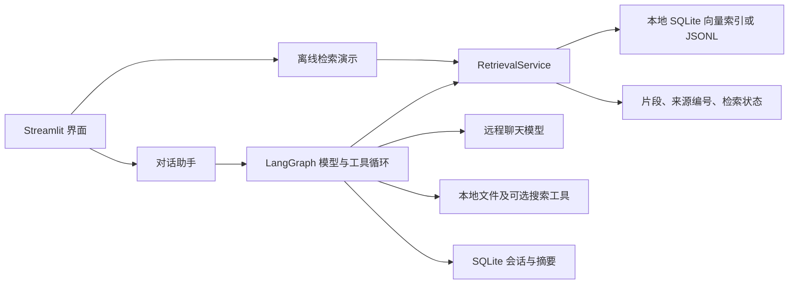

# 架构与适用边界

本项目把分散的游戏设计资料变成可追溯的检索依据。当前语料为 6 个来源、6,515 个知识块；本地 BGE、SQLite 和 LangGraph 构成底座，聊天生成使用可选配置的远程模型。离线检索演示不需要聊天 API，但不能生成模型回答。

## 两条运行路径

- `game_agent/settings.py` 校验配置；`prompts.py` 集中回答与摘要规则；`local_files.py` 限制文件访问范围及读取量；`presentation.py` 还原最终回答、核对引用编号并导出来源。
- `wiki_corpus/retrieval.py` 供界面、Agent 和评估复用。BGE 查询只加载本地模型缓存；BM25 使用中文字符及相邻双字、英文词；混合模式用 RRF 合并排名，再按 BGE 相似度筛选。BM25 分数、RRF 分数都不是概率。
- 索引、模型缺失或语义服务不可用时，回退到 JSONL/BM25，并标记 `fallback`、`keyword_only` 或 `no_evidence`。主动选择 BM25 不是故障降级。明确的非游戏行业问题返回 `out_of_domain`；模糊语境需要核对。

## 为什么采用全量向量扫描

SQLite 保存向量与元数据；首次使用加载到进程内并缓存归一化矩阵，查询做一次全量矩阵乘法和排序。6,515 块、单用户、低并发下，这便于复现和排查，省去额外向量服务与近似索引调参。计算量随块数和维度增长，排序也有开销；“适合当前规模”是工程选择，不是已测出的延迟指标。扩容前测冷启动、内存、检索延迟和召回；规模或并发明显增长时再比较 FAISS/HNSW。查询编码器必须与索引模型一致。

## 调用与上下文限界

LangGraph 在模型和工具间循环，默认每个用户回合最多 6 轮工具请求，允许配置为 1–12；一轮可能包含多个工具调用。达到上限会结束并提示尚未得到可靠答案，递归限额提供额外保护。聊天请求默认超时 60 秒；工具轮数、超时和重试限制用于控制等待与成本，不保证一定得到答案。

默认估算输入预算为 12,000 tokens，旧对话压缩时保留最近 4 个完整用户回合；摘要输入最多 16,000 字符，摘要输出预算为 1,500 tokens。最终上下文仍超预算时，进一步去除完整旧回合、缩短工具文本，仍放不下则报错。原始历史保留，摘要仅供续聊，不能作为引用证据；截断和摘要都可能丢失信息，估算值也不等于供应商实际计费。

## 适用范围

这是本地单用户应用，未实现面向公共服务的账号隔离、权限体系或并发容量保证。离线检索不会调用聊天模型；首次构建 BGE 索引可能下载模型。聊天和摘要会向配置的远程接口发送问题及必要上下文，可选联网搜索另有外部请求。

来源编号核对只能判断编号是否存在于当前或最近上下文的真实检索记录中，不能证明结论被原文支持。追问引用已有证据时，界面保留并标记该证据来自前一回合。领域判断也是规则边界，并非覆盖所有行业的可靠分类器。

三种检索策略的测量结果见 [检索实验](experiments.md)。检索指标不包含聊天模型的回答质量。
